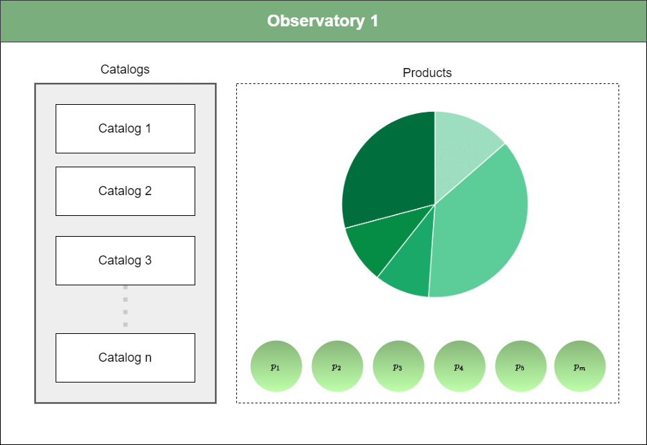

 

QLX API is a RESTful API designed to support querying and management of data using the QLX model. This project provides a structured way to represent, organize, and query multi-dimensional data across attributes like spatial, temporal, categorical, and measurable variables. 

<ul>
    <li><b>Products</b>: The main element of interest, represented by a set of attributes.</li>
    <li><b>Xvariables</b>: Variables describing specific characteristics (e.g., location, time, categories).</li>
    <li><b>Catalogs</b>: A dynamic collection of Xvars, used for organizing and validating attributes across specific categories.</li>
    <li><b>Observatory</b>: Represents a space from which products and their characteristics are observed and queried.</li>
</ul>

 
<!-- The QLX model is designed to manage and query products based on multiple attributes. This model is particularly useful for representing complex, multi-dimensional data, where each product has multiple characteristics that can be categorized across spatial, temporal, categorical, and measurable dimensions. The QLX model enables flexible querying, allowing users to filter products based on specific criteria across these dimensions. -->
The QLX model as depicted in the diagram enables the creation of a dynamic and flexible UI by leveraging the relationships between observatories, catalogs, products, and Xvars. 

 
Fig.1  

Here’s how each component contributes to building a dynamic user interface:

### Observatory
An <b>Observatory</b> in the QLX model acts as a workspace or context where a user can explore and interact with data. Each observatory includes:
    <ol>
        <li>A specific set of catalogs: Each catalog represents a collection of Xvars grouped by dimensions (e.g., spatial, temporal, interest, observable, info, and product type).</li>
        <li>A set of products: Products in an observatory match combinations of Xvars from the selected catalogs.</li>
    </ol>
This concept allows the UI to dynamically adapt to the observatory’s context, only showing products and filters (Xvars) relevant to that particular observatory. Users can select different observatories to quickly shift between different data views, each defined by distinct catalogs and associated products.
<!-- OCAAPI is a RESTful API designed to support querying and management of data using the QLX model. The API enables clients to interact with products and variables (Xvars), utilizing flexible, multi-dimensional queries. This document provides an overview of the API structure, functionality, and key components. -->

### Catalog

Each <b>Catalogs</b> in the observatory represents a collection of Xvars for a specific dimension (e.g., spatial, temporal, interest, observable, info or product type). For example:

- <b>Spatial Catalog</b>: It might include Xvars like Country, State, or City.

- <b>Temporal Catalog</b>: It contains time-based Xvars like Year or Date ranges.

- <b>Interest Catalog</b>: It could represent demographic data, such as Age or Sex.
- <b>Observable Catalog</b>: is a collection of Xvars that represent measurable attributes or metrics associated with products. These observable variables are typically quantitative and provide insights
- <b>Info Catalog</b>: These variables do not necessarily influence the primary filtering criteria but serve as useful details to better understand the product or its data source.
- <b>Product type Catalog</b>: It is a collection of Xvars that define the nature or category of each product within the QLX model. 

### Product

<b>Products</b> in an observatory are filtered combinations of Xvar values from the catalogs. Each product can be visualized as a dataview, chart, or item in the UI, and the attributes used to filter products are based on the Xvars defined in the catalogs for that specific observatory.

For instance: 

- A pie chart could show product distribution based on an observable variable (e.g., mortality rate).

- A list or grid view might display individual products, with filters applied based on the selected Xvars from each catalog.

Because products are directly tied to combinations of values from the catalogs, the UI can easily update visualizations and data displays based on user selections in the catalogs. If a user filters by "State = SLP" and "Date = 2020," only products that match these criteria will be displayed.

### XVariables

The Xvars are the foundation of the entire QLX model, hence the name QLX. Everything in the model depends on Xvars:

- **Catalogs** are collections of Xvars grouped by dimensions.

- **Products** match specific combinations of Xvar values across catalogs.

- **Observatories** are collections of products and catalogs, which themselves are defined by Xvars.

Because Xvars are modular and can represent any attribute or dimension, they make the UI extremely flexible. Each Xvar is essentially a unit of data that can be displayed, filtered, or grouped in the UI. By combining and arranging Xvars within catalogs and observatories, the UI can dynamically adjust to new requirements without needing hard-coded structures.

